# 485信号质量判断

目标：使用rk3588试试判断485信号，可通过分数判断信号的质量。

由于485信号属于时序数据，因此该问题属于时间序列异常检测范畴

整体框架

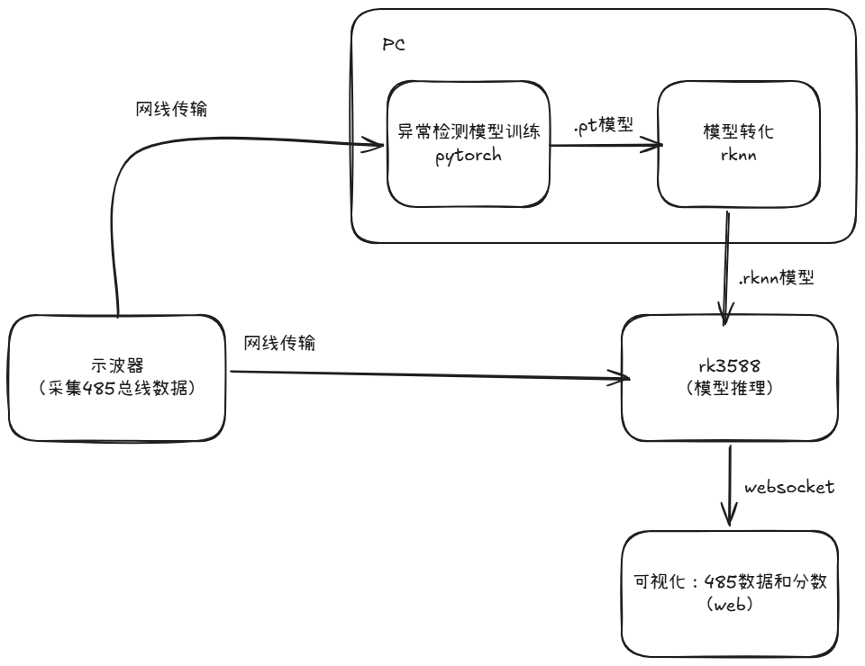

## 文件夹结构

```shell
E:.
├─attachments			# readme附件
├─docker				# rknn转化所用的环境
├─Inference-rk3588		# 推理，运行在rk3588
├─PaAno-model			# 模型训练，运行在PC
├─reference				# 参考文件
└─torchtorknn			# 模型转化
```


## 算法参考论文

论文：[PaAno: Patch-Based Representation Learning for Time-Series Anomaly Detection](https://arxiv.org/abs/2602.01359)

github：[PaAno](https://github.com/jinnnju/PaAno)

## PaAno算法

### 摘要

尽管最近关于时间序列异常检测的研究越来越多地采用越来越大的神经网络架构，例如 Transformer 和 Foundation 模型，但它们会产生高昂的计算成本和内存使用量，使得它们对于实时和资源受限的场景来说不切实际。此外，在严格的评估协议下，它们通常无法证明比更简单的方法有显着的性能提升。

在本文中，我们提出了一种基于 Patch 表征学习的时间序列异常检测方法——**PaAno（Patch-based representation learning for time-series Anomaly detection）**。PaAno 是一种轻量级且高效的时间序列异常检测方法，能够实现快速、有效的异常检测。

PaAno 首先从训练时间序列中提取短时间窗口（Temporal Patch），然后利用 **1D 卷积神经网络（1D CNN）** 将每个 Patch 编码为向量表示。模型通过结合 **Triplet Loss（三元组损失）** 和 **Pretext Loss（预训练任务损失）** 进行训练，以确保学习到的嵌入向量能够充分捕获输入 Patch 中的重要时间模式信息。

在推理阶段，PaAno 通过比较当前时刻邻域内 Patch 的嵌入表示与训练集中正常 Patch 的嵌入表示之间的相似性，计算该时刻的异常分数。

在 **TSB-AD Benchmark** 基准测试上，PaAno 取得了当前最优（State-of-the-Art，SOTA）的性能。在单变量和多变量时间序列异常检测任务中，无论是在区间级（Range-wise）还是点级（Point-wise）的多种评测指标下，PaAno 均显著优于现有方法，包括许多基于大型复杂网络架构的方法。

### 训练架构

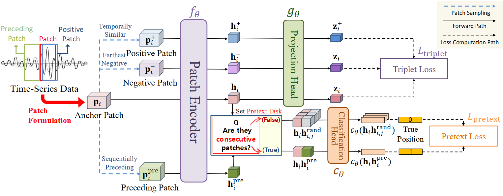

- Patch：时序数据的基本单位：简单来说就是一个滑动窗，滑动窗的大小固定，步长固定。神经网络的基本输入单位
- Preceding  Patch：Patch的前序序列，偏移步长刚好是滑动窗口，用于计算后续需要的Pretext损失
- Positive Patch：随机偏移r步获取的patch。论文认为相邻的Patch均有相似性。
- Negative Patch：在整个minibach中离Patch最远的滑动窗。训练时将整个minibach送入网络。选取第一个或者最后一个作为Negative Patch。认为改Patch和Patch最不像。
- Patch Encoder：一个简单的编码器，论文中使用4个一维卷积+平均池化层组成
- Projection Head：一个2层MLP，利用Patch、Preceding  Patch、Negative Patch计算Triplet Loss。
- Triplet Loss：鼓励Patch和Positive Patch距离更近（相似），Patch和Negative Patch距离更远（不相似），时整个损失趋近于0

$$
L_{\text{triplet}}
=
\frac{1}{M}
\sum_{i=1}^{M}
\max \Big(
0,\;
\mathrm{dist}(z_i, z_i^{+})
-
\mathrm{dist}(z_i, z_i^{-})
+
\delta
\Big)
$$

* classification head：一个2层MLP的分类算法，Patch和Preceding  Patch的标签为1，代表连续。
* rand patch：从minibach随机选择U个，rand patch和Patch的标签为0，代表不连续，
* Pretext Loss：鼓励Patch和Preceding  Patch在时间上连续。

$$
L_{\text{pretext}}
=
\frac{1}{M}
\sum_{i=1}^{M}
\left[
-\log c_{\theta}(h_i, h_i^{\mathrm{pre}})
-\frac{1}{U}
\sum_{j=1}^{U}
\log\left(
1-c_{\theta}(h_i,h_{i,j}^{\mathrm{rand}})
\right)
\right]
$$

其中classification head和Projection Head仅仅用于训练，不用于推理。三个模型学习 **Patch之间的相似性（Triplet Loss）**，还学习 **Patch之间的时间连续性（Pretext Loss）**

### memory bank

PaAno关键一环，保存时序数据的表征特征，由于PaAno只有编码器，没有解码器，无法通过重构判断时序是否异常。因此在训练完毕后，将所有训练数据送入Patch Encoder，得到表征特征库，由于征特征库太大，后续通过k-means缩小，最终得到固定个数的表征特征作为memory bank，用于推理时计算异常分数。memory bank相当于代表正常数据特征。推理时，正常数据和memory bank相似，异常数据和memory bank差别大。

### 推理架构

推理只涉及Patch Encoder和memory bank。

- patch Encoder计算表征特征
- memory bank通过计算和实时数据的表征特征的距离打分。分数越低，数据越正常，分数越高，数据越异常。

### 异常分数计算

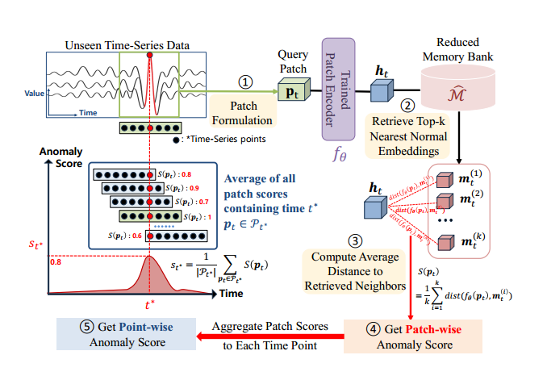

1. patch：将整个数据使用滑动窗口取patch，并将patch送入已经训练好的patch Encoder，得到$h_{t}$
2. $h_{t}$和memory bank中的所有向量计算距离并计算平均距离，该距离作为patch级别的异常分数
3. 将该点的所有patch分数的平均数作为点异常分数。

## 模型训练

基于485数据训练模型

### 数据采集

基于示波器采集采集数据，通过`pyvisa`库解析数据然后保存。

示波器参数：

```python
# 基本设置
commands = [
                # (命令, 期望响应)
                (f":CHANnel{channel}:DISPlay ON", "1"),               # 打开通道
                (f":CHANnel{channel}:SCALe 2", "2.000000E+00"),       # 设置通道电压刻度为2V/div
                (f":CHANnel{channel}:OFFSet 0", "0.000000E+00"),      # 设置通道的垂直偏移为0V
                (f":TIMebase:MODE MAIN", "MAIN"),                     # 设置时间基准为MAIN YT模式
                (f":TIMebase:SCALe 0.000001", "1.000000E-6"),            # 设置时间刻度为500us/div
                (f":TRIGger:MODE EDGE", "EDGE"),                     # 设置触发模式为边沿触发
                (f":TRIGger:EDGE:SOURce CHAN{channel}", f"CHAN{channel}"),  # 设置触发源为通道1
                (f":TRIGger:EDGE:LEVel 1", "1.000000E0"),        # 设置触发水平为1V
                (f":CHANnel1:PROBe 10", "10"),                     # 设置探头衰减比为10X
                # (f":TRIGger:SWEep SINGle", "SING"),               # 设置触发模式为单次触发
            ]
# 采集设置
 commands = [
                # (命令, 期望响应)
                (f":WAV:SOUR CHAN{channel}", f"CHAN{channel}"),    # 设置通道
                ("WAV:MODE RAW", "RAW"),                           # 设置读取数据模式: 读取内存中的波形数据(读取时需要停止示波器)      
                ("WAV:FORM WORD", "WORD"),                         # 设置数据的返回格式：一个波形点占用2个字节
                (f":ACQuire:MDEPth 10k", "1.0000E+04"),           # 设置波形深度(要求采样速率控制在20M) 
                ("WAVeform:POINts 10000", "10000"),              # 设置波形点数
                ("WAVeform:STARt 1", "1"),                         # 设置起始点
                ("WAVeform:STOP 10000", "10000"),                # 设置结束点
            ]
```

以上设置，将采样频率设置为`65.2MSa/s`,，触发模式选取单次触发，即每次触发保存10K数据，然后保存，作为训练数据（保证保存的数据均为正常数据）。

以下为采集数据可视化

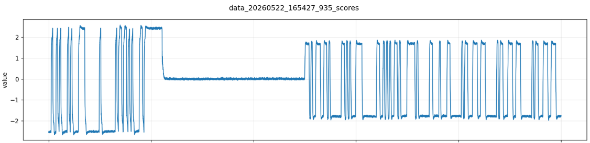

### 模型训练

模型使用PaAno，为适配本次的数据模式，需要实现` DataLoader`

1. 加载txt数据
2. 对数据切片，使用滑动窗口。滑动步数为1
3. 封装到` DataLoader`

```python
def create_txt_patch_dataloader(data_dir, patch_size, batch_size=512, stride=1, shuffle=True):
    """
    对给定文件件中的txt文件进行预处理，生成patch数据集。
    Args:
        data_dir (str): 包含txt文件的目录路径
        patch_size (int): 每个patch的长度
        batch_size (int): DataLoader的批次大小
        stride (int): 切片的步长
        shuffle (bool): 是否打乱数据
    """
    # 获取训练数据
    data_parts = load_txt_data_parts(data_dir, patch_size)
    # 切片:
    patches = torch.cat(
        [preprocess_to_patches(data, patch_size=patch_size, stride=stride) for data in data_parts],
        dim=0,
    )
    # train_model 需要每个 patch 携带相对顺序索引。
    indices = torch.arange(len(patches), dtype=torch.long).unsqueeze(1)
    loader = DataLoader(
        TensorDataset(patches, indices),
        batch_size=batch_size,
        shuffle=shuffle,
    )

    logger.info(f"Training patches: {len(patches)}")
    logger.info(f"Training batches: {len(loader)}")
    logger.info(f"Training batch_size: {loader.batch_size}")
    return loader, patches

```

训练：调用PaAno模型

```python
# 训练模型
        train_model(
            model,
            train_loader,
            train_patches,
            self.device,
            num_iter=self.num_iters,
            pretext_step=self.patch_size,
            lr=self.lr,
            writer=writer,
        )
```

模型保存：必须使用`TorchScript`，后续需要转化为rknn模型

```python
 # 导出 TorchScript 编码器，供部署或推理使用。
        model.eval()
        torch.jit.trace(
            model,
            torch.randn(1, self.in_channels, self.patch_size).to(self.device),
        ).save("./output/trained_model.pt")

```

memory bank保存：最多保留500条向量

```python
memory_bank, indices_tensor = create_memory_bank(model, train_loader, self.device, num_cores=500)
memory_bank =  memory_bank.detach().cpu().numpy()
np.save("./output/memory_bank.npy", memory_bank)
```

### 模型PC端推理验证

在PC端直接加载`trained_model.pt`进行推理


由于使用的正常数据，因此分数均比较低，在帧开始和结束时有波动。

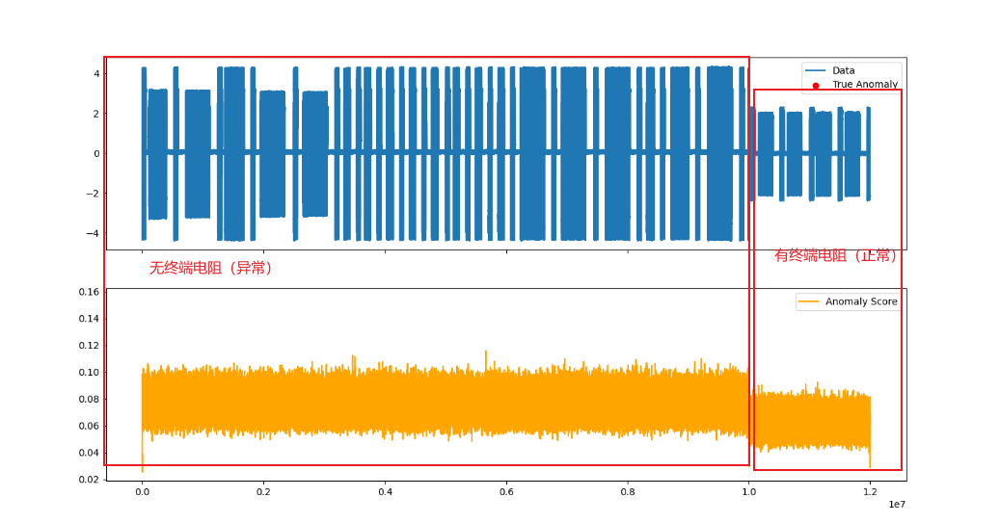

采集了不带终端电阻的数据（异常并非训练数据），发现模型可区别，认为模型训练有效。

## 模型转化

模型最终想在rk3588上做推理。因此需要对模型进行转化

pt转rknn难度不大，按照https://github.com/rockchip-linux/rknpu2进行即可。

```python
 model = '../PaAno-model/output/trained_model.pt'


    # 创建RKNN对象
    rknn = RKNN(verbose=True, verbose_file='./rknn.log')

    # 配置参数
    print('--> Config model')
    rknn.config(target_platform='rk3588')
    print('done')

    # 加载模型
    print('--> Loading model')
    input_size_list = [[-1, 1, 256]]
    ret = rknn.load_pytorch(model=model, input_size_list=input_size_list)
    if ret != 0:
        print('Load model failed!')
        exit(ret)
    print('done')

     # 编译模型
    print('--> Building model')
    ret = rknn.build(do_quantization=False)
    if ret != 0:
        print('Build model failed!')
        exit(ret)
    print('done')

    # 转化模型
    print('--> Export rknn model')
    ret = rknn.export_rknn('../PaAno-model/output/rk3588-PaAno.rknn')
    if ret != 0:
        print('Export rknn model failed!')
        exit(ret)
    print('done')

    # 初始化推理环境
    ret = rknn.init_runtime()
    if ret != 0:
        print('Init runtime environment failed')
        exit(ret)

    # 推理
    # 产生随机输入数据: 格式[[1, 1, 64]]
    
    data = np.random.randn(10, 1, 256).astype(np.float32)

    outputs = rknn.inference(inputs=[data])
    print(outputs)
    print(outputs[0].shape)
```

1. 由于模型简单，转化非常容易成功。
2. 目前使用的固定batch。即1个

3. 最终保存的模型为`rk3588-PaAno.rknn`
4. 由于模型简单，不进行量化等特殊配置，所有配置均使用默认

## rk3588上推理

首先使用离线推理，验证推理结果和PC相似

### 离线推理

```python
logger.info(f'使用txt离线数据进行推理')
            for txt_path in sorted(self.data_path.glob("*.txt")):
                # 加载数据
                logger.info(f"推理txt文件: {txt_path}")
                data = self.load_txt_data(txt_path)
                # 推理
                outputs = self.rknn_inference(self.rknn_lite, data)
                logger.info(f"推理结果: {outputs.shape}")
                # 计算patch分数
                patch_scores = self.calculate_patch_scores(outputs, self.mb_normalized, self.top_k)
                # 计算点分数
                point_scores = self.distribute_patch_scores_to_points(patch_scores, self.patch_size)
                # 保存分数
                output_path = self.score_dir / f"{txt_path.stem}_scores_rk3588.csv"
                with open(output_path, "w", newline="", encoding="utf-8-sig") as f:
                    writer = csv.writer(f)
                    writer.writerow(["index", "value", "anomaly_score"])
                    for idx, (value, score) in enumerate(zip(data, point_scores)):
                        writer.writerow([idx, float(value), float(score)])
```

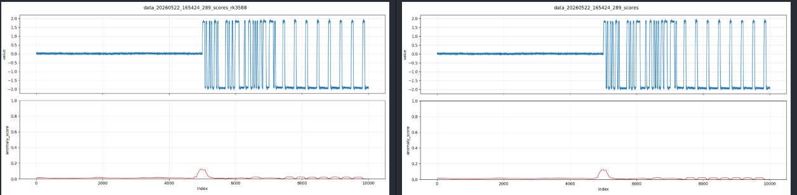

在PC和rk3588上推理同一段数据。定性来看，两者打分情况大致一致，说明模型转化正常，

### 在线推理

在线推理则是直接推理示波器采集的数据。

#### 10k数量下正常情况

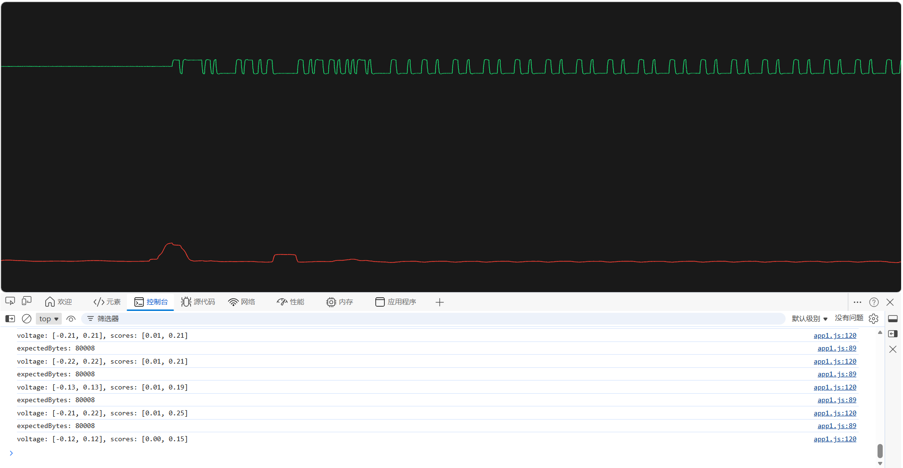

正常数据下，最大异常分数为0.15

#### 10k数量下正常但波形较差情况

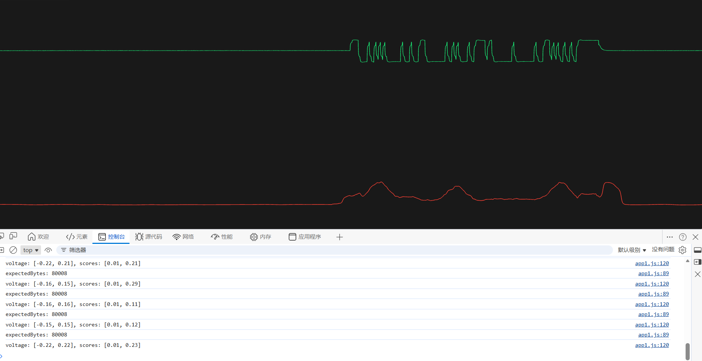

以上波形较差，但是485转换器可正常识别，最大异常分数为0.23。

#### 10K数据量下无堵头情况

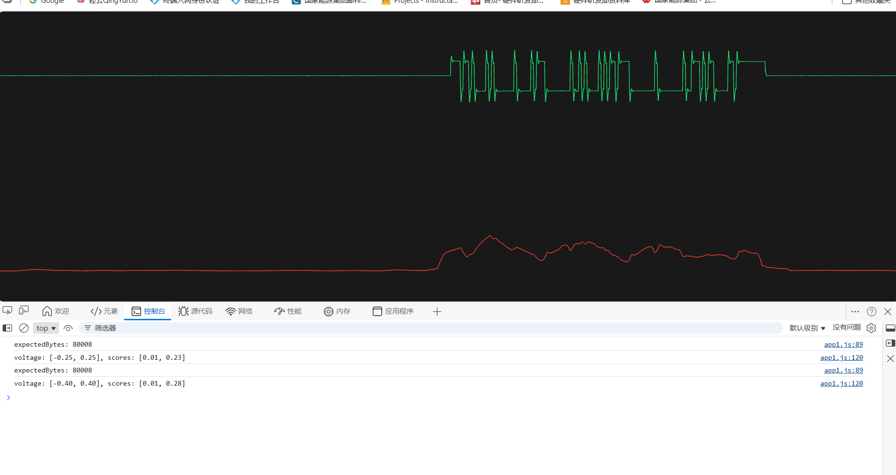

无堵头时，分数曲线波动明显，最大异常分数来到0.28。

#### 10K数据量下485数据线松动

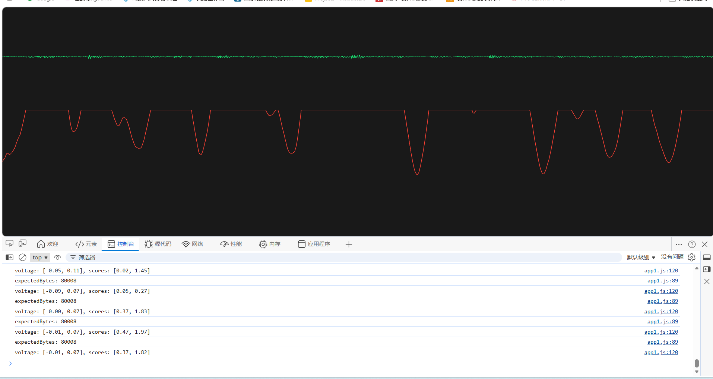

数据线松动时，总线以无波形，但是幅值有稍微变动。这是分数异常严重，高达1.82。

#### 1K数据量下实时推理

由于一次性10K数据时间花费为7秒。实时推理太慢，因此保证采集速率不变的情况下，一次性推理数据变为1K。降低数据量后勉强看着像实时，期间异常也能识别。

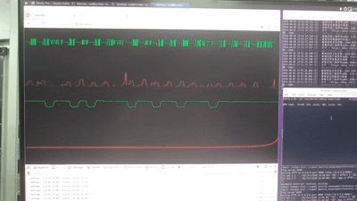

